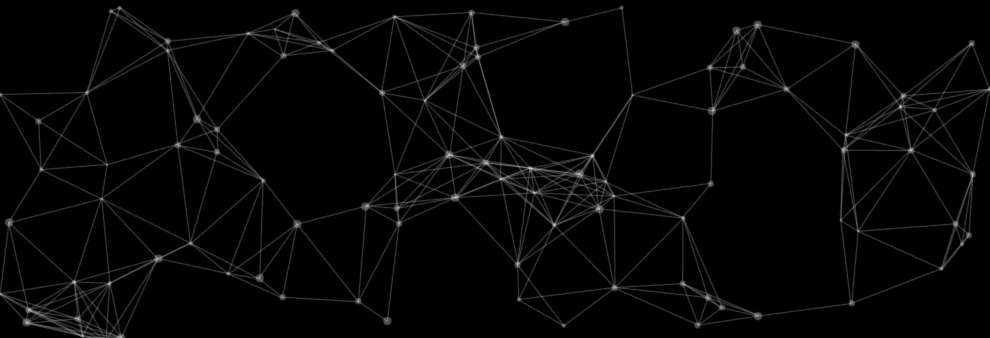

## JS页面装饰插件

### 预览



[在线预览](http://seejs.me/dot-line/demo/index.html)

### 使用方法

* ES6 Module
```js
import DotLine from 'dot-line';

const dec = new DotLine(option);
```

* AMD Module
```js
const DotLine = require('dot-line').default;

const dec = new DotLine(option);
```

* Online url
```xml
<script src="${script_path}/DotLine.min.js"></script>
<script>
(() => {
    const Component = DotLine.default;
    const dec = new Component(option);
})();
</script>
```

### Options

* `points<Int>`: 整数，生成点的个数，默认`200`
* `maxPointSize<Number>`: 数字，产生圆点的最大半径，结果为`[1, maxPointSize]`，默认`[1, 2]`
* `pointColor<String>`: 生成圆点的颜色值，任意合法颜色值的字符串，默认`rgba(255, 255, 255, 0.3)`
* `lineColor<String>`: 点与点之间连线的颜色值，任意合法颜色值的字符串，默认`rgba(255, 255, 255, 0.3)`
* `lineWidth<Number>`: 连线宽度，默认`0.5`
* `maxSpace<Number>`: 最大连线距离，当距离大于该值的点不会连线，默认值`100`
* `speed<String>`: 控制点的移动速度，可选值：`fast`、`slow`，默认正常速度
* `parentId<String>`: 被装饰的容器ID，默认装饰`body`区域

### 其他

组件动画基于Canvas实现，动画点数量过大容易导致页面占用大量资源，组件内部已做了一定的优化，但使用时仍需谨慎，根据个人情况合理设置动画点数量。
